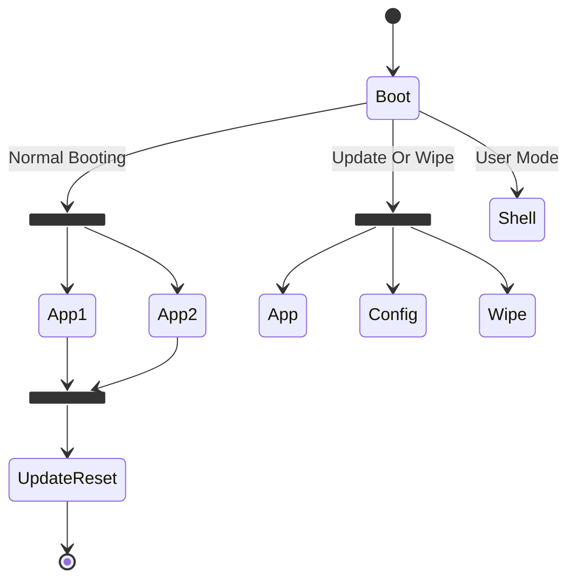
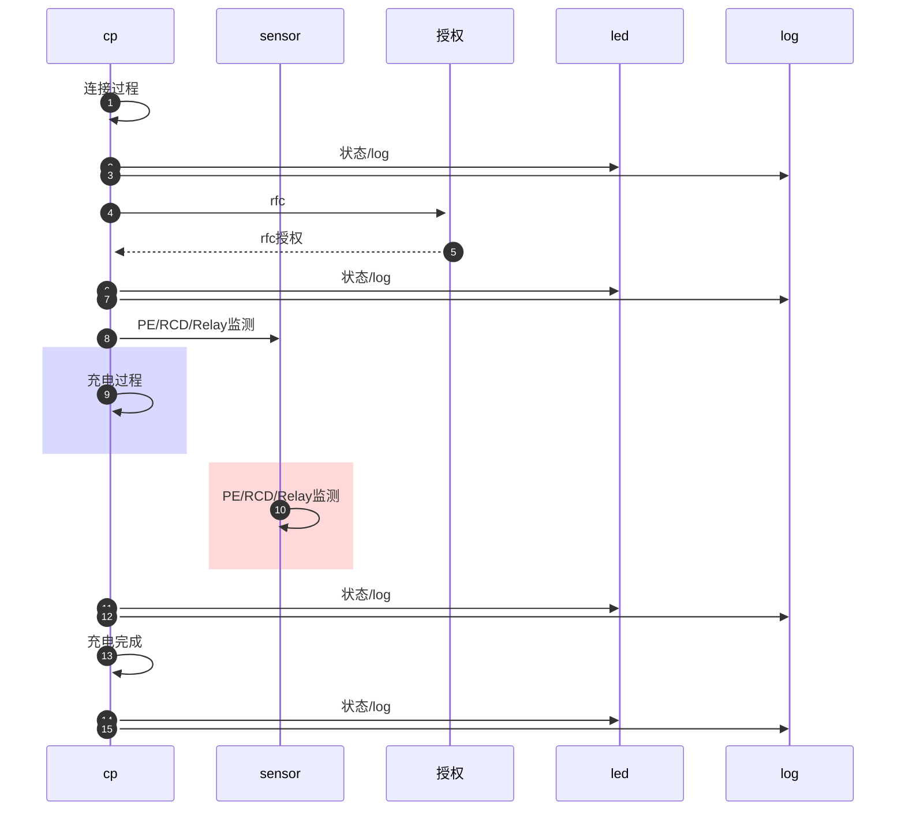
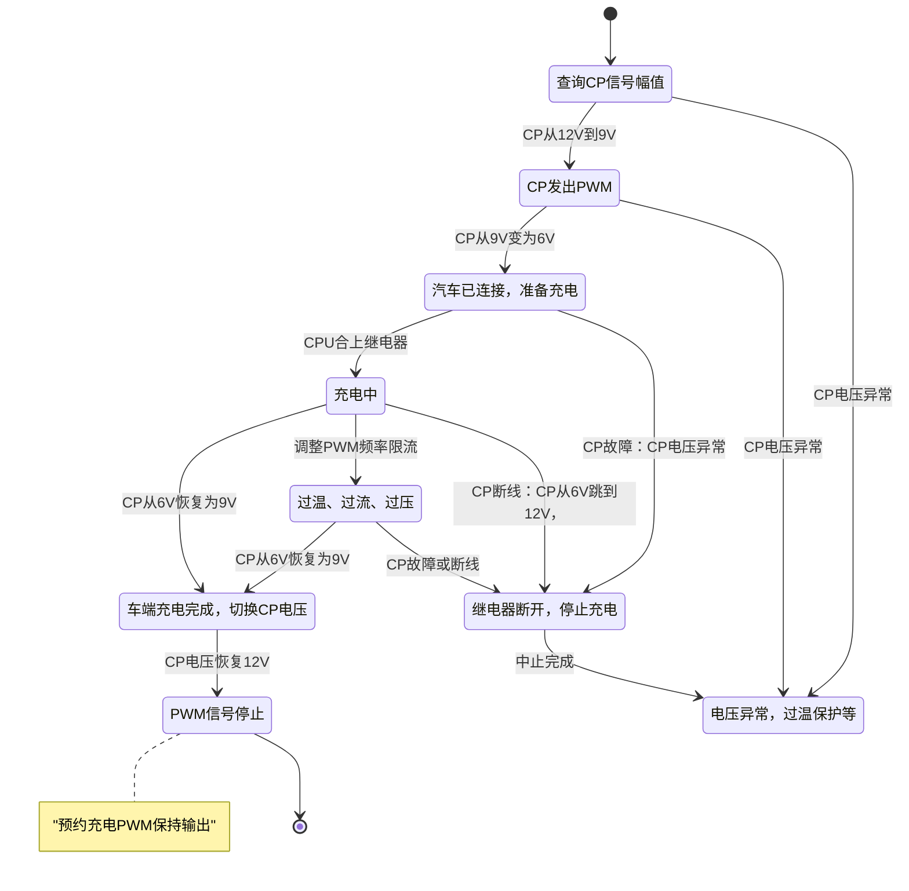
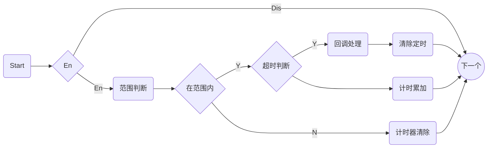

###### <sub>GWDR™</sub><br />电动汽车充电系统<br />──<br /><sup>应用软件实现参考手册</sup><br />`#版本|V0.1#(theme2)`<br /><br />**游荣强**<br />*COPYRIGHT © 2021. GWDR°DESIGN.*

[TOC]

# 配置及启动

## 存储配置

​	系统设计使用Boot加Application模式，Boot可更新Application，Application也可更新其它的区域。**更新Boot时必须保障更新过程不能中断**。由于Flash的XIP（片内直接运行，无需加载到RAM中）运行限制，Bootloader需支持直接对Bootloader之后的Flash进行烧写。

###### Flash分区

| 分区（大小） |     模块      | 说明                                    |
| :----------: | :-----------: | :-------------------------------------- |
|     96KB     |     Boot      | Bootloader                              |
|     32KB     |    Config     | 系统配置信息                            |
|     32KB     | ConfigDefault | 默认配置信息                            |
|    864KB     |     Data      | 系统运行过程中的Log信息，需要保存的数据 |
|    1536KB    | Application1  | 应用程序区1                             |
|    1536KB    | Application2  | 应用程序区2                             |

## 运行状态

​	系统支持Bootloader和App部分独立程序，Bootloader状态下，支持一些硬件验证与调试功能，初始的应用更新也将由Bootloader实现。

###### 系统运行状态定义

| 系统状态 | 描述                                            | 模块       |
| -------- | ----------------------------------------------- | ---------- |
| 常规启动 | Bootloader模式下，系统更新或调试模式时          | Bootloader |
| 命令行   | 在Bootloader下提供的Command命令行模式，用于调试 | Bootloader |
| 应用更新 | 在Booloader下更新应用或配置信息                 | Bootloader |
| Boot更新 | 在Application下更新Bootloader                   | 应用       |
| 系统待机 | 装置启动后，无操作时间超时，系统进入待机模式    | 应用       |
| 正常运行 | 唤醒后，充电，BLE连接，标定                     | 应用       |
| 系统故障 | PE接地，RCD保护，过流，过压，电网频率等异常     | 应用       |

## 启动流程

​	如图所示，系统启动后进入Boot模式，Bootloader实现三种模式，根据系统配置命令决定进入何种流程。正常的启动流跳转，根据系统配置字决定启动流程。

###### 启动运行流程




## 配置内容

| 配置项 | 配置名称 | 值范围 | 说明 |
| -------- | -------------------- | ---- | -------- |
| 设备名称 | Name | 64Bytes Device Name | 设备名称 |
| 序列号 | Serial | 32Bytes Serial Number | 序列号 |
| 启动模式 | bootMode | 0 - Undefined | 未定义 |
| ^^ | ^^ | 1 - NormalBoot | 正常启动App |
| ^^ | ^^ | 2 - UpdateApp | 更新App |
| ^^ | ^^ | 3 - UpdateConfig | 更新配置信息 |
| ^^ | ^^ | 4 - WipeData | 恢复设置 |
| 激活分区 | activeIndex | 1 - Application1 | 激活App1 |
| ^^ | ^^ | 2 - Application2 | 激活App2 |
| 应用校验码1 | appCRC1 | 64B CRC code | 应用分区校验码，预留64B |
| 应用校验码1 | appCRC2 | 64B CRC code | 应用分区校验码，预留64B |
| MAC地址 | macAddr | 11:22:33:44:55:66 | Mac地址（BT） |
| IP地址 | ipAddr | 192.168.1.100 | IP地址（4G） |
| 网关 | gateway | 192.168.1.1 | 网关（4G） |
| 子网掩码 | netmask | 255.255.255.0 | 子网掩码（4G） |
| 配置信息校验 | configCRC | 64B Config CRC code | 当前配置信息校验码，预留64B |
| 标定参数区 | coef | 1 | 针对各个采样参数的标定系数，条目数根据实际的采样数据量 |

# 任务设计

按实现的功能模块进行

## 任务划分

###### 应用任务划分

| 任务名          | 短标识    | 任务标识             | 功能描述                             |
| --------------- | --------- | -------------------- | ------------------------------------ |
| 充电流程控制    | cp        | task_charger_manager | 完整的CP信号连接过程处理，           |
| 传感器器监测    | sensor    | task_sensor_monitor  | 监测传感器运行状态，提供系统安全保护 |
| LED-HMI状态管理 | led       | task_led_hmi         | LED灯板状态管理任务                  |
| 系统标定        | calibrate | task_calibrate       | 系统参数标定(串口或CAN)              |
| RFC刷卡服务     | rfc       | task_rfc_service     | RFC刷卡任务处理                      |
| BT/BLE连接服务  | ble       | task_ble_service     | BLE蓝牙连接任务                      |
| 4G连接服务      | 4g        | task_4g_service      | 4G通讯连接任务                       |
| LOG记录服务     | log       | task_log_service     | 事件记录及管理                       |
| 系统管理        | system    | task_system          |                                      |
| 更新服务        | update    | task_update          | 由系统管理建立触发                   |
| XCP协议栈       | xcp       |                      |                                      |
|                 |           |                      |                                      |

###### 主要任务间处理流程



## 任务交互

# 任务实现

## 充电任务

充电任务只处理CP信号连接过程，和正常的充电流程

### 充电流程

>1. 在充电线缆没有插入车辆时，此时慢充口CC处的电压为12v或5v，此时CP处没有电压。
>
>2. 供电插口连接到充电桩（供电设备）以后，S1开关接通12v，此时如果测量枪口CP口会测得12v电压值。
>
>3. 将充电枪插入车辆充电口后，检测点3就能够检测到12v电压经过RC和S3开关入地，这时检测点3的电压便不再是12v，此时车辆可以通过检测点3检测到充电枪已经插入到插口上。R4电阻的作用是检测充电枪有没有插到位，如果没有插到位则S3开关（位于充电枪上）断开，R4电阻串联进回路，通过检测点3便可以让充电机知晓。另外，通过检测点3检测的电压便可以知道RC阻值的大小，进而知道充电枪的型号。
>
>4. 充电枪插入车辆充电口以后，12v电压通过S1、R1，依次到达检测点1和检测点2，然后通过R3接地构成回路，此时检测点1以及检测点2处的电压便不再是12v，由于R1=1000欧，R3=3000欧的分压，检测点电压为9v。
>5. 当检测到电压为9v以后，S1开关从12v变到PWM信号链接，此时监测点1和2会出现一个从9v变化到-12v的占空比信号，确认充电枪连接好，然后S2开关闭合反馈给充电设备。S2闭合以后回路接入了R1（串联），R2和R3（电阻并联，R2=1500欧，并联电阻阻值为1000欧），回路电压从9v变成6v，此时充电机就可以认可充电。
>
>6. CP信号稳定在6v以后，供电设备的K1和K2继电器闭合，交流电通过车辆充电口输入到充电机进行充电。
>
>   


### 充电时序


### 充电状态转换


## 传感器管理

传感器用于监测系统的运行状态，在出现系统异常时，调用相应的函数的执行相关的保护动作，实现系统的安全管理。

### 传感器监测机制

###### 传感器范围检测判断公式

$$
范围判断公式：当前值 \in (设定高值, 设定低值)* 持续时间 \to 处理回调函数
$$

### 数据结构

###### 传感器检测数据结构结构

```c
struct sensor_monitor_t {
    int id;										// 传感器ID编号
    char name[NAME_LEN];						// 传感器名称
    int enable;									// 总使能开关
    int	(*read)(int *value);					// 读取函数
    int (*callback)(int, int, int);				// 出现警告时回调处理函数，三个参数为当前值，出错类型，和出错类型
    int high_warn;						   		// 警告高值
    int high_error;								// 错误高值
    int low_warn;								// 警告低值
    int low_error;								// 警告低值
    int high_warn_enable;						// 警告高值使能
    int high_error_enable;						// 错误高值使能
    int low_warn_enable;						// 警告低值使能
    int low_error_enable;						// 错误低值使能
    int high_warn_timer;						// 警告高值定时
    int high_error_timer;						// 错误高值定时
    int low_warn_timer;							// 警告低值定时
    int low_error_timer;						// 错误低值定时
};
```

避免使用动态内存分配，系统中所有的传感器监测静态定义为列表

```c
#define SENSOR_NUMBER	16
struct sensor_monitor_t sensor_monitor_array[SENSOR_NUMBER];
```

### 监测流程

传感器监测为独立任务，处理流程如下

###### 检测处理流程



### 传感器

###### 系统中的传感器列表

| ID   | 名称       | 错误下限 | 警告下限 | 警告上限 | 错误上限 | 执行动作                                         | 监测时机                   |
| ---- | ---------- | -------- | -------- | -------- | -------- | ------------------------------------------------ | -------------------------- |
| 0    | PE状态     |          |          |          |          | 停止充电，设置错误状态                           | 充电之前，及充电过程中     |
| 1    | RCD状态    |          |          |          |          | 停止充电，设置错误状态                           | 充电之前，及充电过程中     |
| 2    | 继电器状态 |          |          |          |          | 禁止充电                                         | 充电之前                   |
| 3    | 环境温度   |          |          |          |          | 普通过温限制充电，严重过温时禁止充电，或停止充电 | 充电之前和充电过程中       |
| 4    | 电流       |          |          |          |          |                                                  |                            |
| 5    | 充电电压   |          |          |          |          | 限制充电                                         | 充电前检查，充电过程中监测 |
| 6    | 电网频率   |          |          |          |          |                                                  | 充电前检查，充电过程中监测 |
|      |            |          |          |          |          |                                                  |                            |

## Log任务

## 

###### END