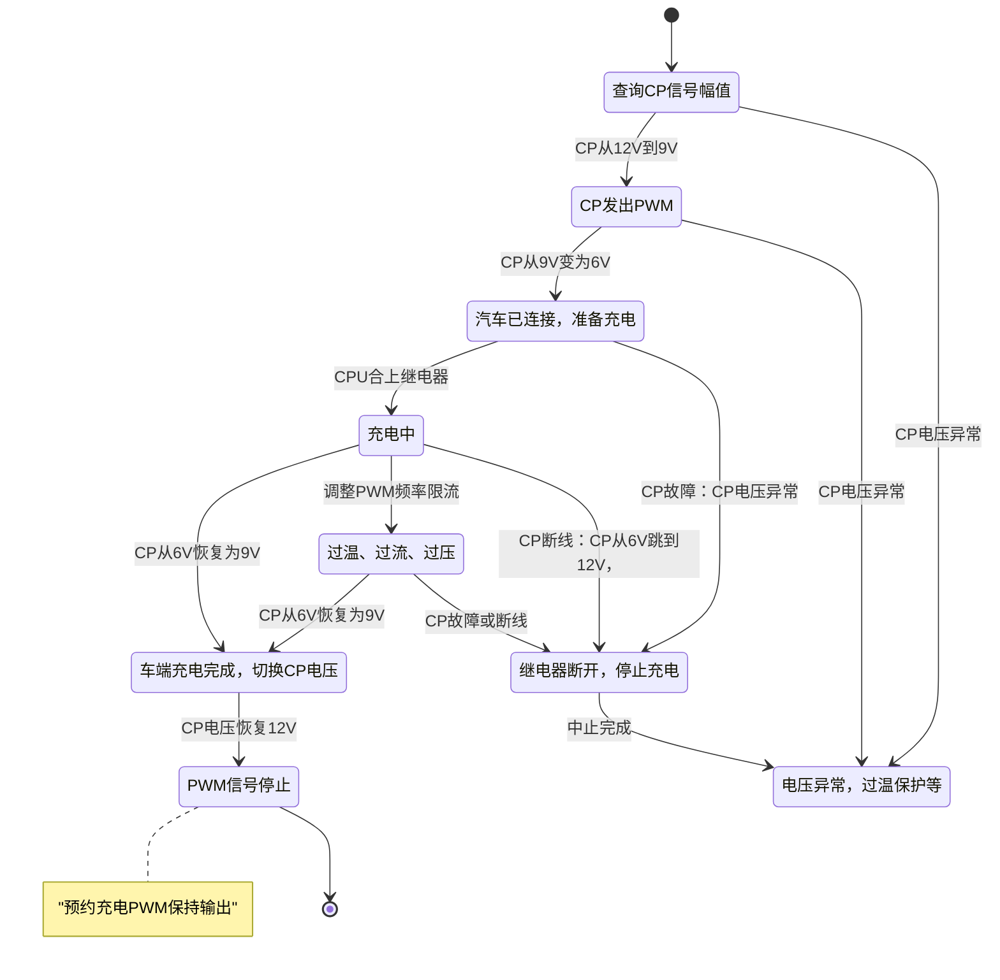

### 1. 存储配置
系统设计使用Boot加Application模式，Boot可更新Application，

| 分区（大小） | 模块        | 说明                    |
| ------------ | ----------- | ----------------------- |
| 0 - 64KB     | Boot        | Bootloader              |
|              | Config      | 系统配置信息            |
|              | Log         | 系统运行过程中的Log信息 |
|              | Application | 应用程序                |

### 2. 系统状态 


| 系统状态 | 描述                                         | 关联任务         |
| -------- | -------------------------------------------- | ---------------- |
| boot     | Bootloader模式下，系统更新或调试模式时       | Bootloader       |
| 待机状态 | 装置启动后，无操作时间超时，系统进入待机模式 | RFC扫描，BLE扫描 |
| 工作状态 | 唤醒后，充电，BLE连接，标定                  |                  |
| 故障状态 | PE接地，RCD保护，过流，过压，电网频率等异常  |                  |
| 调试状态 | 设备标定，工厂调试                           | XCP              |

每种状态下应对几种工作模式

```mermaid
stateDiagram
[*]-->Boot
Boot-->
state Boot {

}
```


### 充电流程

>1. 在充电线缆没有插入车辆时，此时慢充口CC处的电压为12v或5v，此时CP处没有电压。
>
>2. 供电插口连接到充电桩（供电设备）以后，S1开关接通12v，此时如果测量枪口CP口会测得12v电压值。
>
>3. 将充电枪插入车辆充电口后，检测点3就能够检测到12v电压经过RC和S3开关入地，这时检测点3的电压便不再是12v，此时车辆可以通过检测点3检测到充电枪已经插入到插口上。R4电阻的作用是检测充电枪有没有插到位，如果没有插到位则S3开关（位于充电枪上）断开，R4电阻串联进回路，通过检测点3便可以让充电机知晓。另外，通过检测点3检测的电压便可以知道RC阻值的大小，进而知道充电枪的型号。
>
>4. 充电枪插入车辆充电口以后，12v电压通过S1、R1，依次到达检测点1和检测点2，然后通过R3接地构成回路，此时检测点1以及检测点2处的电压便不再是12v，由于R1=1000欧，R3=3000欧的分压，检测点电压为9v。
>5. 当检测到电压为9v以后，S1开关从12v变到PWM信号链接，此时监测点1和2会出现一个从9v变化到-12v的占空比信号，确认充电枪连接好，然后S2开关闭合反馈给充电设备。S2闭合以后回路接入了R1（串联），R2和R3（电阻并联，R2=1500欧，并联电阻阻值为1000欧），回路电压从9v变成6v，此时充电机就可以认可充电。
>
>6. CP信号稳定在6v以后，供电设备的K1和K2继电器闭合，交流电通过车辆充电口输入到充电机进行充电。
>
>   


充电时序

#### 充电状态转换




